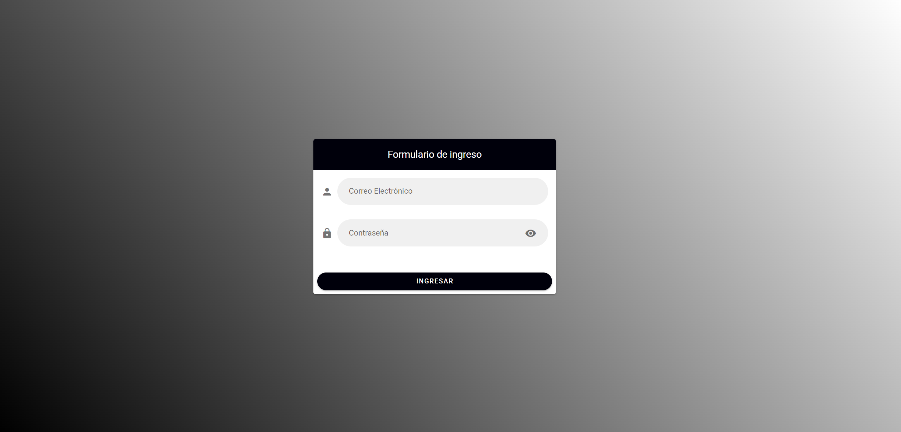
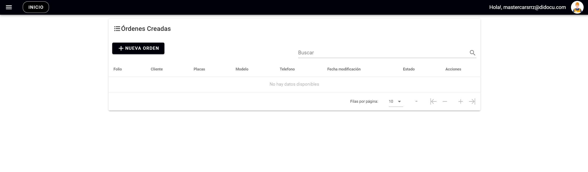
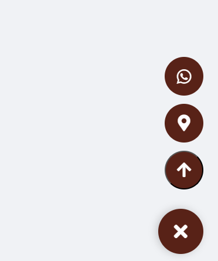
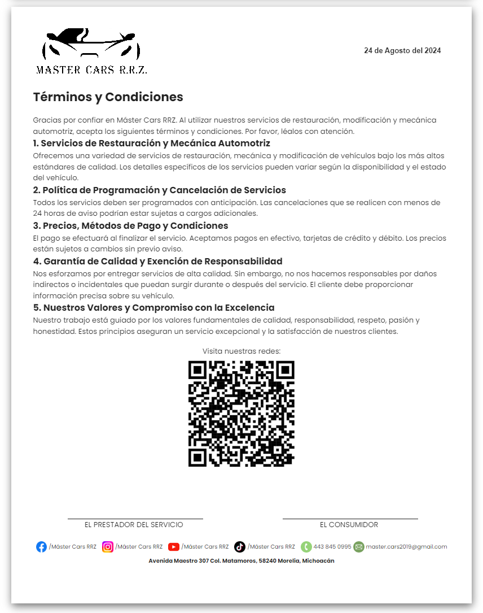

# Máster Cars RRZ

## **Credenciales**
Correo: mastercarsrrz@didocu.com
Contraseña: Maestro307

## **Instalación**
Sigue estos pasos para instalar el proyecto, ejecutarlo y generar el build.

1. Instala las dependencias:
npm i

2. Ejecuta el servidor de desarrollo:
npm run serve

3. Para generar el build de producción:
npm run build

## Descripción General del Trabajo
Este trabajo va enfocada en la gestión de talleres mecánicos. El sistema permite registrar y seguir los datos de los clientes, vehículos, y servicios a través de un panel administrativo conectado a una base de datos en Firebase. Este sistema organiza las órdenes de servicio de manera eficiente, permitiendo a los usuarios registrar, modificar, y eliminar registros. La interfaz está diseñada utilizando los colores y logotipo de la empresa.

## **Login**
En la pantalla de login, los usuarios deben ingresar su correo electrónico y contraseña para acceder al sistema. El diseño combina los colores del logotipo para mantener la coherencia visual de la marca.

## **Pagina de Bienvenida**
En la página de bienvenida se presenta una imagen de fondo elegida por el cliente, con textos grandes que dan la bienvenida. Se muestra el nombre de la empresa, seguido de dos botones que redirigen a la tabla de registro de órdenes y la tabla de registro de notas o presupuestos.

## **Panel Lateral**
El panel lateral es un menú de navegación que se expande automáticamente al acercar el mouse. Desde este panel, los usuarios pueden navegar entre el "Panel de Órdenes" y el "Panel de Notas". Su diseño permite una experiencia fluida e intuitiva para cambiar entre las diferentes secciones del sistema.

## **Panel de Registros Ordenes**
El panel de registros se conecta directamente con una base de datos en Firebase, donde se muestran todas las órdenes y registros almacenados. Cada ítem puede ser editado o eliminado, y también es posible crear nuevas órdenes a través de un formulario accesible desde el panel.

## **Nueva Orden**

### **Página 1**
En esta primera página, se presenta el logotipo de la empresa junto con la ubicación del taller y el número de orden generado automáticamente según el total de órdenes registradas (total+1). El número de orden puede ser editado si es necesario. A continuación, se despliega un formulario con campos para ingresar los datos del coche, fechas, detalles del cliente, y el trabajo a realizar.

La página también incluye iconos que indican las condiciones del coche, un checkbox para marcar el inventario (como herramientas y accesorios), una barra dinámica que indica el nivel de gasolina, y un diagrama en 2D del coche (frontal, trasero, derecho e izquierdo) para señalar cualquier daño preexistente. Los usuarios pueden firmar el formulario directamente en la pantalla, utilizando el dedo o el ratón. Al final, se genera un código QR que puede ser escaneado o clickeado para redirigir al sitio web del taller.

### **Página 2**
Esta página permite agregar hasta cuatro fotos reales del vehículo, cada una con su descripción correspondiente. También se muestra un pie de página con enlaces a las redes sociales de la empresa (Facebook, Instagram, Youtube), así como información de contacto (teléfono, correo electrónico) y un enlace a Google Maps con la ubicación del taller.

### **Página 3**
En la última página, se incluye un contrato con la fecha actualizada automáticamente al momento de generar la orden. Se muestran los términos y condiciones del servicio, un código QR y, nuevamente, los campos para la firma. El pie de página continúa mostrando enlaces a las redes sociales y otros detalles de contacto de la empresa.

## **Panel de Notas**
Similar al panel de órdenes, el panel de notas está diseñado para gestionar las notas de venta o presupuestos. Desde aquí, el usuario puede crear, editar y eliminar registros. Cada nota se guarda en la base de datos, y es posible visualizar el historial completo de notas de cada cliente.

## **Nueva Nota**

### **Página 1**
En esta página, se encuentra un switch que permite cambiar el título del documento entre 'Presupuesto' o 'Nota de Venta'. Se presenta un formulario donde se piden los datos generales del cliente, como nombre, teléfono, modelo de vehículo y otros detalles relevantes. A continuación, se despliega una tabla en la que se pueden agregar artículos que el cliente va a comprar. La tabla permite ingresar la cantidad y precio de cada artículo, y automáticamente se calcula el importe.

Además, se realiza el cálculo del total, incluyendo el IVA si está marcado. También se solicita un anticipo, el cual se resta del subtotal. Finalmente, se muestra el total de la venta.

La página también incluye un campo para indicar el método de pago (tarjeta, efectivo, transferencia), un área para la firma de conformidad del cliente, y un pie de página con los datos de contacto y ubicación del taller.

