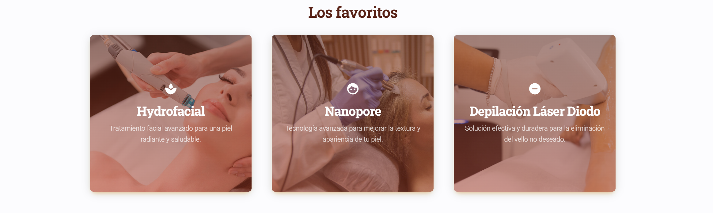
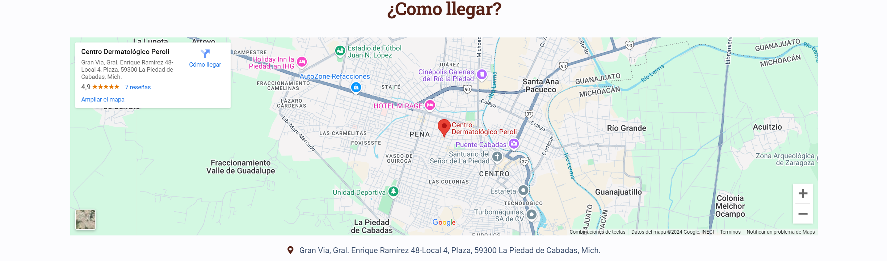
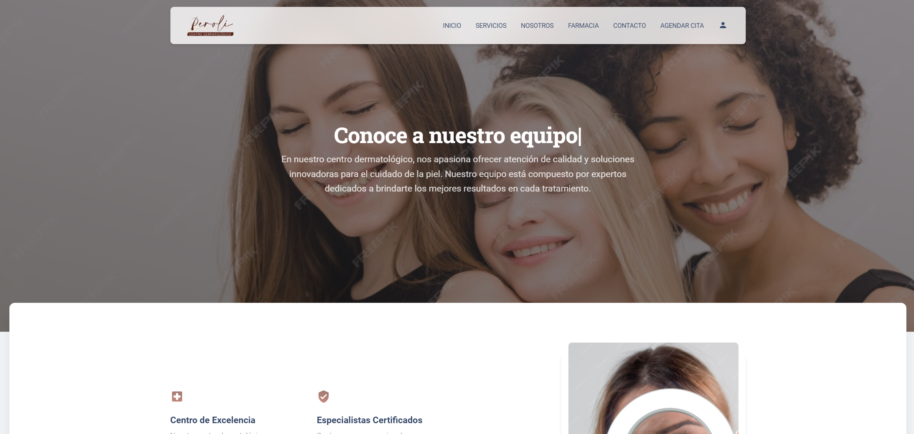
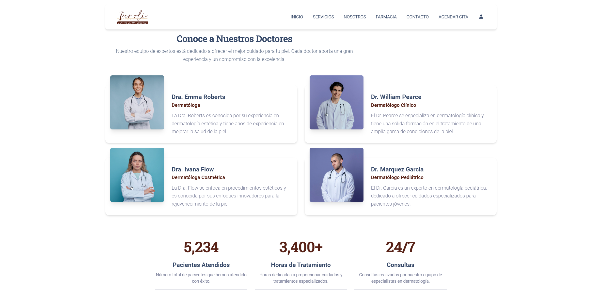
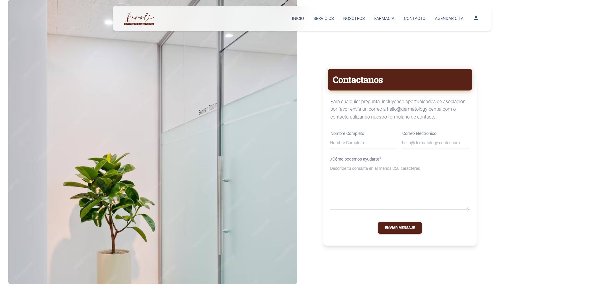

# Peroli Centro Dermatológico

## **Credenciales**
Correo: perolicd@gmail.com
Contraseña: Enrique48

## **Instalación**
Sigue estos pasos para instalar el proyecto, ejecutarlo y generar el build.

1. Instala las dependencias:
npm i

2. Ejecuta el servidor de desarrollo:
npm run dev

3. Para generar el build de producción:
npm run build

Este proyecto es una aplicación web creada para un centro dermatológico que proporciona una experiencia visual atractiva y responsiva para los usuarios en diversas plataformas. El sitio cuenta con varias secciones clave y características que mejoran la navegación y la interacción del usuario.

## Descripción General

El proyecto incluye una página principal que presenta un **carrusel de imágenes**, una **cinta de promociones** y una **barra de navegación**. También muestra cartas de los tratamientos favoritos como **Hydrofacial**, entre otros. Para una mejor experiencia de usuario, se han implementado varias **animaciones**.

El sitio incluye las siguientes secciones ya funcionales:
- **Inicio**
- **Nosotros**
- **Contáctanos**
- **Inicio de Sesión (Login)**

Además, cuenta con **reseñas de pacientes**, un **mapa interactivo**, un **footer** profesional, y un **botón flotante** que permite realizar acciones rápidas como:
- Ver ubicación en el mapa
- Subir al inicio de la página
- Contactar por WhatsApp

## Secciones Funcionales

1. **Inicio**: Contiene un carrusel de imágenes con títulos y descripciones, una barra de navegación, cartas de tratamientos destacados, y una cinta de promociones.
2. **Nosotros**: Sección que muestra información detallada sobre el centro dermatológico y sus profesionales.
3. **Contáctanos**: Incluye un formulario de contacto y un mapa interactivo para localizar el centro.
4. **Inicio de Sesión (Login)**: Pantalla de inicio de sesión para que los usuarios puedan acceder a su cuenta.

## Características Principales

- **Carrusel de Imágenes**: El carrusel en la página principal muestra imágenes atractivas con títulos y descripciones que destacan los servicios ofrecidos por el centro.
- **Cinta de Promociones**: Una franja promocional que destaca ofertas o tratamientos especiales.
- **Barra de Navegación**: Facilita el acceso a todas las secciones importantes del sitio.
- **Cartas de Tratamientos Favoritos**: Visualización de los tratamientos más destacados, como Hydrofacial.
- **Botón Flotante**: Acceso rápido a acciones como ver el mapa, volver al inicio o contactar por WhatsApp.
- **Reseñas de Pacientes**: Sección que muestra comentarios y valoraciones de los usuarios.
- **Mapa Interactivo**: Facilita la ubicación del centro en un mapa.
- **Footer**: Incluye enlaces a redes sociales y otros detalles importantes de contacto.
- **Diseño Responsivo**: El diseño está optimizado para **dispositivos móviles** y **tabletas**, asegurando que todo el contenido se ajuste correctamente sin perder el estilo ni funcionalidad.

## Responsividad

El proyecto está diseñado para ser completamente **responsivo**. Esto significa que todos los elementos visuales y secciones se adaptan de manera adecuada a diferentes tamaños de pantalla, asegurando una experiencia de usuario fluida tanto en **celulares** como en **tabletas**.

## Capturas de Pantalla

A continuación, algunas capturas de pantalla del proyecto en funcionamiento:

- 
- 
- 
- 
- 
- 
- 
- 
- 
- 